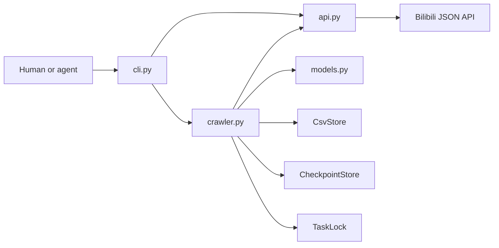

# bilibili_crawler_cli

[](https://github.com/A11MiND/bilibili_crawler_cli/actions/workflows/ci.yml)
[](https://www.python.org/)
[](./LICENSE)

A zero-third-party-dependency command-line tool for exporting Bilibili video comments. Given a single video URL or BVID, it serially crawls every root and child comment visible to the current session via Bilibili's JSON API, streams the results to CSV, and resumes from the last committed checkpoint after any interruption.

The CLI is designed for both humans and automation. Any LLM, coding agent, shell script, or CI job that can execute a local command can drive it through `--json`, without depending on a specific model, IDE, MCP server, or vendor SDK.

Current version: `0.3.1 Alpha`. For bugs, feature requests, security reports, and the contribution workflow, see [Issues](https://github.com/A11MiND/bilibili_crawler_cli/issues), [SECURITY.md](./SECURITY.md), and [CONTRIBUTING.md](./CONTRIBUTING.md).

A more detailed, line-by-line implementation walkthrough is available in Chinese in [README_CN.md](./README_CN.md).

## 1. Scope (Phase 1)

### 1.1 Implemented

- Accepts a standard Bilibili video URL or BVID.
- Resolves the video identifier and basic metadata.
- Crawls every root comment visible to the current session.
- Crawls every child comment visible under each root comment.
- Uses a detail cursor for large child-comment threads, avoiding the max-offset limit of the legacy paged endpoint.
- Writes UTF-8 BOM–encoded CSV output.
- Persists a checkpoint after every batch write.
- Automatically resumes an interrupted task on re-run.
- De-duplicates by comment ID.
- Uses a task lock to prevent concurrent writes to the same video.
- Retries transient network errors and HTTP 408/429/5xx with limited backoff.
- Distinguishes anonymous crawls from authenticated crawls.
- Validates cookies against the live API; an expired cookie never silently degrades to an anonymous crawl.
- Extracts the IP-region field when the API returns it; leaves it blank otherwise.
- Provides both human-readable output and a stable single-object JSON output.
- Shows a live single-line progress indicator (count, rate, elapsed time) in an interactive terminal.
- Provides `status`, `capabilities`, and `auth` subcommands.
- Ships an agent-readable `SKILL.md` with the installed package.
- Uses only the Python standard library at runtime.

### 1.2 Out of scope

- Batch/multi-video jobs.
- A GUI or web interface.
- Selenium, Playwright, browser drivers, or DOM automation.
- Reading browser cookies automatically, QR-code login, or bypassing login.
- Proxy pools, high concurrency, CAPTCHA handling, or anti-risk-control evasion.
- Sentiment analysis, word clouds, data cleaning, or other analytics.
- Guaranteed access to deleted, under-review, collapsed, or identity-restricted comments.

"All comments" in this document always means: every comment the current session can actually see through the live API at crawl time. The comment count shown on the web page may include content the API does not return, so it is not a strict acceptance criterion.

## 2. Requirements

- Python 3.12 or later.
- macOS, Linux, or WSL. Phase 1 uses POSIX `fcntl` file locking and does not directly support native Windows processes.
- Network access to Bilibili's public API.
- No dependency on `requests`, `httpx`, `pandas`, Selenium, or a browser driver.

Check your Python version:

```bash
python3 --version
```

## 3. Installation

### 3.1 Standard install

From the project root:

```bash
python3 -m venv .venv
source .venv/bin/activate
python -m pip install .
```

Verify:

```bash
bilibili-crawler --help
bilibili-crawler capabilities --json
```

The virtual environment isolates the CLI from system Python and is compatible with Homebrew Python's PEP 668 protection.

### 3.2 Install as a global CLI

If `uv` is available, install into an isolated environment and add it to PATH:

```bash
uv tool install . --python 3.12
bilibili-crawler capabilities --json
```

`uv` is only used for isolated installation — it is not a runtime dependency of this project.

### 3.3 Development install

For local source changes:

```bash
python3 -m venv .venv
source .venv/bin/activate
python -m pip install -e .
```

### 3.4 Run without installing

From the project root:

```bash
python3 -m bili_comments --help
```

`bilibili-crawler` is the primary command. `bili-comments` and `python3 -m bili_comments` are kept as compatible entry points.

## 4. Quick start

### 4.1 Anonymous crawl

```bash
bilibili-crawler crawl "BVxxxxxxxxxx" --anonymous
```

A full URL also works:

```bash
bilibili-crawler crawl "https://www.bilibili.com/video/BVxxxxxxxxxx/" --anonymous
```

Anonymous requests can usually access public video comments. Anonymous responses typically omit the IP-region field, so that CSV column is left blank.

### 4.2 Interactive input

```bash
bilibili-crawler crawl --anonymous
```

If no video argument is given and `--json` is not set, the CLI prompts for a URL or BVID.

### 4.3 Terminal progress

In human mode, if stderr is an interactive terminal, the crawl shows an in-place progress line: rows written, root/child comment counts, rate, elapsed time, and an approximate percentage based on the page's reported comment count (when available). Without a page total, only counts are shown.

When stderr is not a TTY, output degrades to plain line-by-line logging with no ANSI control codes. In `--json` mode, stdout always contains exactly one final JSON envelope; progress goes to stderr only and never uses dynamic terminal control. Any in-place progress line is cleaned up on normal completion, error, or interruption.

### 4.4 Authenticated crawl

Save a cookie first:

```bash
bilibili-crawler auth set
```

Input is hidden via `getpass` and never echoed to the terminal. Check the default save path with:

```bash
bilibili-crawler auth path
```

On POSIX systems, the cookie file must be owned by the current user and must not be readable by group or other. The CLI saves it with `0600` permissions by default.

Validate it against the live API after saving:

```bash
bilibili-crawler auth check
```

Then crawl:

```bash
bilibili-crawler crawl "BVxxxxxxxxxx"
```

The CLI validates authentication before hitting the video/comment endpoints, and re-confirms login status after each comment page is fully parsed but before it is handed to the storage layer. If the cookie is invalid or expired, that page is not committed and the crawl does not silently fall back to anonymous mode.

### 4.5 Ad-hoc cookie sources

Read from a permission-restricted file:

```bash
bilibili-crawler crawl "BVxxxxxxxxxx" --cookie-file ./cookie.txt
```

```bash
chmod 600 ./cookie.txt
```

Read from an environment variable:

```bash
export BILI_COOKIE='full cookie header'
bilibili-crawler auth check
bilibili-crawler crawl "BVxxxxxxxxxx"
```

Never pass a cookie as a bare command-line argument — arguments can end up in shell history, process listings, or audit logs.

### 4.6 Boundaries on obtaining a cookie

This tool does not read browser databases, does not control a browser, and does not perform automatic login. When authenticated access is needed, the user must obtain the request-header cookie from their own already-authenticated, authorized session, and supply it via hidden input, an environment variable, or a permission-restricted file.

A cookie can carry full account session privileges. Never paste it into a prompt, an issue, a log, a screenshot, a CSV file, a checkpoint, or a Git repository.

## 5. IP region

The IP-region value comes from the comment object's `reply_control.location` field. The tool never infers a region from a user's profile, comment text, or any other field.

In practice:

- Anonymous requests: usually empty.
- Authenticated requests: the API may return an IP region.
- Missing API field: the CSV cell stays blank.
- Historical comments, special accounts, or restricted content: the field may still be blank.
- A valid login session does not guarantee an IP region on every comment.

If a task already completed in anonymous mode, switching to authenticated mode does not retroactively backfill the old CSV. Use `--restart` to archive the old result and re-crawl:

```bash
bilibili-crawler crawl "BVxxxxxxxxxx" --restart
```

## 6. Resuming interrupted crawls

By default, a run produces:

```text
output/{BVID}.csv
state/{BVID}.json
state/{BVID}.lock
```

Running the same video again:

- Incomplete task: resumes from the last committed position.
- Completed task: returns the existing result without re-hitting the comment API.
- CSV/checkpoint mismatch: stops and returns a local state error.
- Task already locked by another process: the second process stops rather than writing concurrently.

The current checkpoint schema is v3, which adds `child_strategy`:

- `page` — legacy paged pagination, kept only for backward compatibility with old checkpoints.
- `detail` — detail-cursor pagination; `sub_cursor` may start at 0.

Schema v2 keeps the original `auth_mode` field and is auto-upgraded to v3. A v1/v2 checkpoint that stopped mid-child-comment-stream is rescanned from detail cursor `next=0` and de-duplicated against comment IDs already in the CSV. Page numbers and detail cursors are semantically different, so the tool never converts an old page number directly into a detail cursor.

Legacy schema v1 auth-mode migration rules:

- Header only, no comment rows written yet: the newly chosen auth mode is adopted and the schema is upgraded.
- Existing data with at least one row carrying an IP region: the old task is inferred to have been authenticated; an anonymous resume is rejected.
- Existing data with all IP-region cells empty: the tool cannot reliably tell whether the old task was anonymous or authenticated, and stops, requiring `--restart`.
- An existing CSV with unescaped spreadsheet-formula prefixes: the tool stops and requires `--restart` rather than performing a risky in-place rewrite.

Normal resume needs no extra flags:

```bash
bilibili-crawler crawl "BVxxxxxxxxxx" --anonymous
```

Discard old progress and start over:

```bash
bilibili-crawler crawl "BVxxxxxxxxxx" --anonymous --restart
```

`--restart` does not delete old files directly — it first renames the existing CSV and checkpoint to timestamped backups, then starts a new task.

## 7. Inspecting a local task

`status` only reads the local CSV and checkpoint — it makes no network requests. It applies the same strict CSV contract used on resume (header, record boundaries, unique comment IDs, formula escaping, parent/child relationships, row counts, committed byte offset) without truncating or modifying the file:

```bash
bilibili-crawler status "BVxxxxxxxxxx"
```

Machine-readable form:

```bash
bilibili-crawler status "BVxxxxxxxxxx" --json
```

Returns:

- Task status and current phase.
- Committed row count and byte offset.
- Root, child, and IP-region row counts.
- Whether the CSV and checkpoint are paired consistently.
- The auth mode used for the crawl.
- Current child-comment strategy, current root comment, and child cursor.
- Absolute paths to the CSV and checkpoint.

## 8. CSV format

File name:

```text
output/{BVID}.csv
```

Encoded as UTF-8 with a BOM so Excel opens it directly. Timestamps are formatted with a `+08:00` offset.

| Column (as written in the CSV) | Meaning |
|---|---|
| 一级评论序号 (root comment index) | Starts at 1 for root comments; a child comment inherits its root's index |
| 隶属关系 (relation) | `一级评论` (root) or `二级评论` (child) |
| 评论ID (comment ID) | Stable ID of this comment |
| 根评论ID (root comment ID) | Its own ID for a root comment; the owning root's ID for a child |
| 父评论ID (parent comment ID) | Empty for a root comment; the direct parent's ID for a child |
| 被评论者昵称 (replied-to nickname) | The video author for a root comment; the API-confirmed direct recipient for a child |
| 被评论者ID (replied-to user ID) | The corresponding user ID, empty when the API can't confirm it |
| 评论者昵称 (author nickname) | Nickname of the comment's author |
| 评论者用户ID (author user ID) | User ID of the comment's author |
| 评论内容 (comment text) | Full comment body |
| 发布时间 (posted at) | `YYYY-MM-DD HH:mm:ss+08:00` |
| 点赞数 (like count) | Non-negative integer; empty if missing |
| IP属地 (IP region) | Raw region text from the API; empty if missing |

Column headers are written in Chinese to match the tool's original CSV contract (and open cleanly in region-appropriate spreadsheet software); this table gives the English meaning of each one.

### 8.1 Excel formula-injection protection

If a nickname, comment body, or other user-controlled text starts with `=`, `+`, `-`, `@`, a tab, or a carriage return, Excel may interpret it as a formula. Before writing to CSV, the tool prepends a single quote to such text.

This only changes how spreadsheet software interprets the cell — it does not alter the crawled data. When the tool loads an existing CSV to rebuild its index, it strips this protective prefix again so author matching and resume logic are unaffected.

### 8.2 Direct reply target

A child comment's direct reply target is only set from reliable evidence:

1. The API object explicitly provides `parent_reply_member`.
2. The parent comment already exists in the current batch or the committed CSV.
3. The parent comment is the root comment itself.

An `@nickname` mention in the comment body is never used to infer identity. When it can't be confirmed, the field is left blank rather than defaulting to the root author.

## 9. For LLMs and coding agents

### 9.1 Integration model

The project exposes plain subcommands, stable JSON, state queries, and a `SKILL.md` file — a process-level interface that isn't tied to any specific model. Any agent that can execute a command and read stdout, stderr, and the exit code can drive it.

The installed package includes:

```text
bili_comments/skills/SKILL.md
```

An agent can read that file first, then query runtime capabilities:

```bash
bilibili-crawler capabilities --json
```

`capabilities` is the current source of truth for commands, exit codes, and the JSON contract — automation should not rely solely on static examples in this README.

### 9.2 Machine-mode guarantees

Whenever `--json` is present:

- stdout contains exactly one JSON object followed by one newline.
- Progress output goes to stderr only.
- stdin is never read implicitly.
- Missing required arguments return a structured error immediately.
- `--json` may appear before or after the subcommand.

Examples:

```bash
bilibili-crawler --json capabilities
bilibili-crawler crawl "BVxxxxxxxxxx" --anonymous --json
bilibili-crawler --json status "BVxxxxxxxxxx"
```

### 9.3 JSON envelope

Success:

```json
{
  "schema_version": 1,
  "command": "crawl",
  "ok": true,
  "exit_code": 0,
  "data": {
    "bvid": "BVxxxxxxxxxx",
    "auth_mode": "anonymous",
    "already_complete": false,
    "counts": {
      "root": 10,
      "child": 20,
      "total": 30,
      "ip_location": 0,
      "ip_location_missing": 30
    },
    "paths": {
      "csv": "/absolute/path/output/BVxxxxxxxxxx.csv",
      "checkpoint": "/absolute/path/state/BVxxxxxxxxxx.json"
    }
  },
  "error": null
}
```

Failure:

```json
{
  "schema_version": 1,
  "command": "crawl",
  "ok": false,
  "exit_code": 6,
  "data": {},
  "error": {
    "code": "authentication_required",
    "message": "cookie has expired"
  }
}
```

Callers must check both the process exit code and `ok`. Don't infer success purely from CSV existence — an interrupted task can also leave a partial CSV behind.

### 9.4 Exit codes

| Code | Meaning | Suggested agent behavior |
|---:|---|---|
| 0 | Success, or the task was already complete | Read `data`, then call `status` to verify |
| 2 | Invalid input or configuration | Fix arguments or cookie source; don't repeat the same command |
| 3 | Video unavailable, inaccessible, or requires different permissions | Explain the access boundary to the user |
| 4 | Transient network, rate-limit, risk-control, or upstream API error | If a crawl already started, keep the checkpoint and retry with backoff |
| 5 | Local storage, checkpoint, or response-format error | Stop writing and inspect local files |
| 6 | Cookie invalid or session expired | Ask the user to reconfigure the cookie |
| 7 | No local task exists | Start a `crawl` if a result is needed |
| 70 | Unclassified internal error in JSON mode | Save a sanitized error and file a bug report |
| 130 | User interrupted | If a crawl already started, repeat the same `crawl` command to resume |

Get the current authoritative set with:

```bash
bilibili-crawler capabilities --json
```

### 9.5 Recommended agent flow

```text
capabilities --json
        |
        v
status <video> --json
        |
        +-- complete ------> return the existing CSV
        |
        +-- running -------> repeat crawl to resume
        |
        +-- not found -----> choose anonymous or authenticated mode
                              |
                              v
                         crawl --json
                              |
                              v
                         status --json
```

1. Call `capabilities --json`.
2. Call `status <video> --json`.
3. If complete, use the existing paths.
4. If incomplete, repeat `crawl` with the same auth mode.
5. If no task exists, choose anonymous or authenticated mode per the user's request.
6. For authenticated mode, call `auth check --json` first.
7. Call `crawl <video> --json`.
8. Branch on the exit code: finish, resume, or ask the user to fix authentication.
9. On success, call `status <video> --json` for a local consistency check.

### 9.6 Example: calling it from a Python agent

```python
from __future__ import annotations

import json
import subprocess


def run_cli(*arguments: str) -> dict:
    completed = subprocess.run(
        ["bilibili-crawler", *arguments, "--json"],
        check=False,
        capture_output=True,
        text=True,
    )
    payload = json.loads(completed.stdout)
    if completed.returncode != payload["exit_code"]:
        raise RuntimeError("process exit code does not match JSON payload")
    if not payload["ok"]:
        raise RuntimeError(payload["error"]["message"])
    return payload["data"]


capabilities = run_cli("capabilities")
result = run_cli("crawl", "BVxxxxxxxxxx", "--anonymous")
status = run_cli("status", result["bvid"])
```

Never build a command with `shell=True` string concatenation of user input — use an argument list to avoid shell injection and escaping bugs.

## 10. Command reference

### 10.1 `crawl`

```bash
bilibili-crawler crawl <video> [--anonymous | --cookie-file PATH] [--restart] [--json]
```

- `<video>` — a BVID or a standard video URL.
- `--anonymous` — don't read any cookie.
- `--cookie-file PATH` — read a cookie from the given restricted-permission file.
- `--restart` — back up and rebuild the task for this video.
- `--json` — emit the machine-readable envelope.

Compatible forms:

```bash
bilibili-crawler <video> --anonymous
python3 -m bili_comments <video> --anonymous
```

### 10.2 `status`

```bash
bilibili-crawler status <video> [--json]
```

Read-only local state check; makes no network requests.

### 10.3 `capabilities`

```bash
bilibili-crawler capabilities [--json]
```

Returns the current version, command table, exit codes, and JSON contract.

### 10.4 `auth set`

Interactive save:

```bash
bilibili-crawler auth set
```

Save from an environment variable (for non-interactive environments):

```bash
export BILI_COOKIE='full cookie header'
bilibili-crawler auth set --from-env --json
```

Save to a specific path:

```bash
bilibili-crawler auth set --cookie-file ./cookie.txt
```

### 10.5 `auth check`

```bash
bilibili-crawler auth check [--cookie-file PATH] [--json]
```

Hits the live account-status endpoint. Success only means the current cookie is a valid session — it does not guarantee every comment and IP region will be visible.

### 10.6 `auth path`

```bash
bilibili-crawler auth path [--json]
```

Shows the default cookie file location without reading or printing its contents.

## 11. System design

### 11.1 Directory structure

```text
bilibili_crawler_cli/
├── .github/
│   ├── ISSUE_TEMPLATE/
│   └── workflows/
├── bili_comments/
│   ├── __init__.py
│   ├── __main__.py
│   ├── api.py
│   ├── cli.py
│   ├── crawler.py
│   ├── models.py
│   ├── storage.py
│   └── skills/
│       └── SKILL.md
├── tests/
├── tools/
├── .gitignore
├── CHANGELOG.md
├── CODE_OF_CONDUCT.md
├── CONTRIBUTING.md
├── LICENSE
├── MANIFEST.in
├── README.md
├── README_CN.md
├── RELEASING.md
├── ROADMAP.md
├── SECURITY.md
└── pyproject.toml
```

The public repository contains core code, community docs, CI, release-audit tooling, and fully sanitized network-free tests. The published wheel/sdist contain only the code needed at runtime, package metadata, the license, and usage docs — no tests. Run output, checkpoints, cookies, caches, internal requirement docs, real API responses, and acceptance records never enter the repo or the published package.

### 11.2 Module relationships



Responsibilities:

- `cli.py` — input parsing, auth-source selection, output protocol, error codes.
- `api.py` — HTTP, request signing, error classification, response mapping.
- `models.py` — internal stable data types.
- `crawler.py` — orchestrates the root/child comment state machine.
- `storage.py` — locking, CSV, de-duplication, checkpointing, and recovery.

For a full function-by-function walkthrough of each module, see [README_CN.md](./README_CN.md#12-逐文件代码说明).

## 12. Key design choices

- **JSON API, not HTML scraping.** The page DOM, lazy loading, and interaction state change often; the comment JSON API gives structured relationships and pagination directly, which suits a resumable task better. Request/response mapping is still centralized in `api.py` in case the API shifts.
- **Standard library only.** Networking, CSV, JSON, argument parsing, locking, and atomic file operations are all handled by the standard library in Phase 1, keeping install complexity and supply-chain surface minimal.
- **Serial requests.** Comment crawling is a validation-first feature; serial requests make it easier to control request rate, pinpoint resumption, and preserve parent/child ordering without concurrent-pagination or shared-state bugs. A future version could add bounded concurrency (e.g. `ThreadPoolExecutor`) across root comments' child-comment streams while keeping a single writer thread — this is intentionally deferred rather than implemented now.
- **Per-page commits.** Checkpointing after every root row and child-comment page balances I/O cost against how much has to be re-crawled after an interruption.
- **`status` is fully offline.** Agents can inspect local state before making any external request, or confirm committed results when the upstream API is unavailable.
- **A plain CLI as the agent interface.** There's no single standard plugin protocol across LLM vendors and agent frameworks. A PATH-installed subcommand, JSON output, exit codes, and `SKILL.md` work across all of them without binding core crawling logic to any one model SDK.

## 13. Security & privacy

- Cookies are never written to the CSV, checkpoint, or normal logs.
- The default cookie file uses atomic writes and `0600` permissions.
- Reads of the cookie file, task lock, CSV, and checkpoint reject symlinks and multi-hardlink files.
- Cookie-bearing requests reject cross-origin redirects and HTTPS downgrades.
- Video input only accepts allow-listed Bilibili hosts and valid BVID format.
- All upstream text fields written to CSV get reversible spreadsheet-formula escaping.
- Checkpoints never store raw API responses.
- The task lock prevents concurrent processes from corrupting state for the same video.
- The public repository contains no real comment data, cookies, run paths, or user information.

Comment CSVs may contain public account IDs, nicknames, comment text, and region data. Before crawling, storing, analyzing, or publishing this data, confirm it complies with the platform's terms, applicable law, research ethics, and data-minimization requirements.

## 14. Known limitations

- Bilibili's API, WBI signing rules, and business error codes may change.
- Visibility, ordering, and pagination are determined by the platform.
- Comments added, deleted, or pinned during a crawl can cause pagination drift; ID-based de-duplication avoids duplicate rows but cannot recover data the API no longer returns.
- IP region is not a guaranteed field.
- Single-video tasks only.
- CSV output only.
- No proxy, CAPTCHA, or anti-risk-control bypass of any kind.

## 15. FAQ

**Can I crawl anonymously?** Usually yes, for public comments on a public video. Visible scope depends on the API and current network conditions. Anonymous results usually lack an IP region.

**I'm logged in but IP region is still empty.** Run `bilibili-crawler auth check` first. Even with a valid session, some rows may still be empty — the tool never infers a value the API didn't return. An existing anonymous task needs `--restart` after switching to authenticated mode.

**I got exit code 4.** Transient network, rate-limit, risk-control, or upstream error. Don't retry aggressively — keep the CSV/checkpoint and retry the same command after a backoff.

**I got exit code 5.** The local CSV, checkpoint, or API response failed a safe-recovery check. Run `bilibili-crawler status "BVxxxxxxxxxx" --json` first; don't hand-edit the checkpoint. Use `--restart` only once you're sure the old result can be discarded.

**I got exit code 6.** The cookie is invalid or expired — re-run `bilibili-crawler auth set` then `auth check`. (Exit code 2 means no cookie was configured at all.)

## 16. License & contributing

This project is MIT licensed. See [CONTRIBUTING.md](./CONTRIBUTING.md) for the dev setup, tests, and PR workflow, [SECURITY.md](./SECURITY.md) for reporting a vulnerability, and [ROADMAP.md](./ROADMAP.md) for direction.

Before submitting a change, confirm it:

- Contains no cookies, tokens, account data, or local absolute paths.
- Contains no real comment data, output CSVs, or checkpoints.
- Adds nothing that bypasses platform access control or anti-scraping mechanisms.
- Maps any new API field into the internal model in `api.py`.
- Adds cross-field validation for any new resumable state.
- Supports a stable `--json` output for any new command, and updates `capabilities` and `SKILL.md` accordingly.
- Is covered by tests using only synthetic BVIDs, users, comments, and placeholder credentials — tests must not access the network by default.

## 17. References

- [HKUDS/CLI-Anything](https://github.com/HKUDS/CLI-Anything/blob/main/README_CN.md) — referenced for its discoverable CLI and agent-usage patterns.
- [CLI-Anything Agent Harness](https://github.com/HKUDS/CLI-Anything/blob/main/cli-anything-plugin/HARNESS.md) — referenced for machine-readable output, state queries, file locking, install-command testing, and `SKILL.md` conventions. This project keeps a standard-library-only implementation and does not adopt its Click/REPL/GUI backend structure.
- [Ghauster/BilibiliCommentScraper](https://github.com/Ghauster/BilibiliCommentScraper) — referenced for incremental-write and resumable-task design. This project does not use its browser-automation approach.
