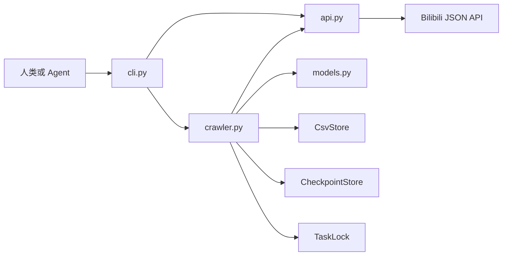

# bilibili_crawler_cli

[](https://github.com/A11MiND/bilibili_crawler_cli/actions/workflows/ci.yml)
[](https://www.python.org/)
[](./LICENSE)

`bilibili_crawler_cli` 是一个使用 Python 标准库实现的哔哩哔哩视频评论导出工具。输入单个视频 URL 或 BV 号后，程序通过 JSON 接口串行抓取当前访问身份可见的一级评论和二级评论，持续写入 CSV，并在中断后从已提交断点继续。

项目同时提供面向人类和自动化程序的命令行接口。任何能够执行本地命令的 LLM、coding agent、Shell 脚本或 CI 任务都可以通过 `--json` 调用，不依赖特定模型、IDE、MCP 服务或厂商 SDK。

当前版本为 `0.3.1 Alpha`。使用问题、缺陷、安全报告和贡献流程分别见 [Issue](https://github.com/A11MiND/bilibili_crawler_cli/issues)、[SECURITY.md](./SECURITY.md) 和 [CONTRIBUTING.md](./CONTRIBUTING.md)。

## 1. Phase 1 范围

### 1.1 已实现

- 输入标准哔哩哔哩视频 URL 或 BV 号。
- 解析视频标识和基础信息。
- 抓取当前访问身份可见的全部一级评论。
- 抓取一级评论下当前可见的二级评论。
- 使用明细游标抓取大型二级评论区，不受旧页码接口最大偏移限制。
- 输出 UTF-8 BOM 编码的 CSV。
- 每批写入后持久化断点。
- 重复运行同一任务时自动续爬。
- 按评论 ID 去重。
- 使用任务锁阻止同一视频并发写入。
- 对临时网络错误、HTTP 408、429 和 5xx 做有限重试。
- 区分匿名抓取和登录抓取。
- 联网校验 Cookie，失效 Cookie 不会静默降级为匿名抓取。
- 提取接口返回的 IP 属地；接口未返回时保留空值。
- 提供人类可读输出和稳定的单对象 JSON 输出。
- 在交互式终端显示单行进度条、计数、速率和耗时。
- 提供 `status`、`capabilities` 和 `auth` 命令。
- 随 Python 包安装 Agent 可读的 `SKILL.md`。
- 运行时只使用 Python 标准库。

### 1.2 不包含

- 批量视频任务。
- GUI 或 Web 页面。
- Selenium、Playwright、浏览器驱动或 DOM 模拟操作。
- 自动读取浏览器 Cookie、扫码登录或绕过登录。
- 代理池、高并发、验证码处理或反风控规避。
- 情感分析、词云、数据清洗或其他分析功能。
- 对已删除、审核中、折叠、仅特定身份可见评论的访问保证。

“全部评论”在本文中始终表示：本次访问身份通过当前接口实际返回的全部可见评论。网页显示的评论总数可能包含当前接口未返回的内容，不能作为严格相等的验收条件。

## 2. 运行要求

- Python 3.12 或更高版本。
- macOS、Linux 或 WSL。Phase 1 使用 POSIX `fcntl` 文件锁，不直接支持原生 Windows 进程。
- 可访问哔哩哔哩公开接口的网络环境。
- 不需要 `requests`、`httpx`、`pandas`、Selenium 或浏览器驱动。

检查 Python 版本：

```bash
python3 --version
```

## 3. 安装

### 3.1 标准安装

在项目根目录执行：

```bash
python3 -m venv .venv
source .venv/bin/activate
python -m pip install .
```

安装后检查命令：

```bash
bilibili-crawler --help
bilibili-crawler capabilities --json
```

虚拟环境隔离 CLI 与系统 Python，兼容启用 PEP 668 保护的 Homebrew Python。

### 3.2 安装为全局可用 CLI

已安装 `uv` 时，可以将工具安装到独立环境并加入 PATH：

```bash
uv tool install . --python 3.12
bilibili-crawler capabilities --json
```

`uv` 只负责安装隔离，不是本项目的运行时依赖。

### 3.3 开发模式安装

需要直接修改源代码时使用：

```bash
python3 -m venv .venv
source .venv/bin/activate
python -m pip install -e .
```

### 3.4 不安装直接运行

在项目根目录执行：

```bash
python3 -m bili_comments --help
```

`bilibili-crawler` 是主要命令。`bili-comments` 和 `python3 -m bili_comments` 作为兼容入口保留。

## 4. 快速开始

### 4.1 匿名抓取

```bash
bilibili-crawler crawl "BVxxxxxxxxxx" --anonymous
```

也可以输入完整 URL：

```bash
bilibili-crawler crawl "https://www.bilibili.com/video/BVxxxxxxxxxx/" --anonymous
```

匿名请求通常可以访问公开视频评论。匿名响应通常不包含 IP 属地，CSV 的 `IP属地` 列会留空。

### 4.2 交互输入

```bash
bilibili-crawler crawl --anonymous
```

未提供视频参数且未启用 `--json` 时，程序会提示输入 URL 或 BV 号。

### 4.3 终端进度

人类模式下，如果 stderr 是交互式终端，抓取过程会原地显示轻量进度行：已写入数量、一级/二级评论数量、速率、耗时，以及基于视频页面评论数的近似百分比。页面总数不可用时只显示计数。

stderr 不是 TTY 时退化为普通逐行日志，不输出 ANSI 控制符。`--json` 模式仍保证 stdout 只有最终单个 JSON envelope，进度只写入 stderr，且不使用动态终端控制。正常结束、错误或中断时都会清理临时进度行。

### 4.4 登录抓取

先保存 Cookie：

```bash
bilibili-crawler auth set
```

输入通过 `getpass` 隐藏，不显示在终端。默认保存路径由以下命令查询：

```bash
bilibili-crawler auth path
```

在 POSIX 系统中，Cookie 文件必须属于当前用户，且权限不能向组或其他用户开放。程序保存的默认权限为 `0600`。

保存后联网验证：

```bash
bilibili-crawler auth check
```

验证通过后抓取：

```bash
bilibili-crawler crawl "BVxxxxxxxxxx"
```

程序会在访问视频和评论接口前校验登录状态，并在每个评论页完整解析后、交给写入层前再次确认登录。Cookie 失效或过期时，该页不会提交，也不会继续执行匿名抓取。

### 4.5 临时 Cookie 来源

从受限权限文件读取：

```bash
bilibili-crawler crawl "BVxxxxxxxxxx" --cookie-file ./cookie.txt
```

文件应执行：

```bash
chmod 600 ./cookie.txt
```

从环境变量读取：

```bash
export BILI_COOKIE='完整 Cookie 请求头'
bilibili-crawler auth check
bilibili-crawler crawl "BVxxxxxxxxxx"
```

不要把 Cookie 直接写入命令参数。命令参数可能进入 Shell 历史、进程列表或审计日志。

### 4.6 获取 Cookie 的边界

本工具不读取浏览器数据库，不控制浏览器，也不自动登录。需要登录数据时，用户应从本人已登录且有权使用的会话中取得请求头 Cookie，并通过隐藏输入、环境变量或权限受限文件提供。

Cookie 可能包含完整账号会话权限。不要将其粘贴到提示词、问题描述、日志、截图、CSV、断点或 Git 仓库。

## 5. IP 属地

IP 属地来自评论对象的 `reply_control.location` 字段。工具不会根据用户资料、文本或其他字段推断地区。

实际结果遵循以下规则：

- 匿名请求：通常为空。
- 已登录请求：接口可能返回 IP 属地。
- 接口字段缺失：CSV 保持空值。
- 历史评论、特殊账号或受限内容：字段仍可能为空。
- 登录状态有效不代表每条评论都有 IP 属地。

如果某任务在匿名模式下已经完成，再切换登录模式不会自动补齐旧 CSV。使用 `--restart` 备份旧结果并重新抓取：

```bash
bilibili-crawler crawl "BVxxxxxxxxxx" --restart
```

## 6. 断点续爬

默认运行目录下会生成：

```text
output/{BVID}.csv
state/{BVID}.json
state/{BVID}.lock
```

再次运行同一个视频时：

- 任务未完成：从最后一个已提交位置继续。
- 任务已完成：直接返回已有结果，不重复请求评论接口。
- CSV 与 checkpoint 不一致：停止并返回本地状态错误。
- 同一视频已有进程持有锁：第二个进程停止，不并发写入。

当前 checkpoint schema 为 v3。v3 增加 `child_strategy`：

- `page`：旧页码分页，仅用于兼容旧断点。
- `detail`：明细游标分页，`sub_cursor` 可从 0 开始。

schema v2 保留原 `auth_mode` 并自动升级到 v3。v1/v2 如果停在未完成的二级评论流，会从明细游标 `next=0` 重扫，并按 CSV 中的评论 ID 去重。页码和明细游标语义不同，程序不会把旧页码直接转换成明细游标。

旧版 schema v1 的认证模式按以下规则迁移：

- 只有表头、尚未写入评论：可采用本次选择的认证模式并升级。
- 已有数据且至少一行包含 IP 属地：可推断旧任务为登录模式；匿名恢复会被拒绝。
- 已有数据但所有 IP 属地为空：无法可靠判断旧任务是匿名还是登录，停止并要求 `--restart`。
- 发现旧 CSV 有未转义的表格公式前缀：停止并要求 `--restart`，不在原文件上做有风险的隐式重写。

正常续爬不需要额外参数：

```bash
bilibili-crawler crawl "BVxxxxxxxxxx" --anonymous
```

放弃旧进度并从头抓取：

```bash
bilibili-crawler crawl "BVxxxxxxxxxx" --anonymous --restart
```

`--restart` 不直接删除旧文件。程序先将现有 CSV 和 checkpoint 改名为带时间戳的备份，再创建新任务。

## 7. 检查本地任务

`status` 只读取本地 CSV 和 checkpoint，不发送网络请求。它使用与续爬相同的严格 CSV 契约检查表头、记录边界、唯一评论 ID、公式转义、父子关系、行数和已提交字节数，但不会截断或修改文件：

```bash
bilibili-crawler status "BVxxxxxxxxxx"
```

机器可读形式：

```bash
bilibili-crawler status "BVxxxxxxxxxx" --json
```

返回内容包括：

- 任务状态和当前阶段。
- 已提交行数与字节数。
- 一级、二级和 IP 属地行数。
- CSV 与 checkpoint 是否成对。
- 抓取时使用的认证模式。
- 当前二级评论策略、当前根评论和二级游标。
- CSV 与 checkpoint 的绝对路径。

## 8. CSV 数据格式

文件名：

```text
output/{BVID}.csv
```

编码为 UTF-8 BOM，便于 Excel 直接打开。时间统一格式化为带 `+08:00` 时区的文本。

| 列名 | 内容 |
|---|---|
| 一级评论序号 | 一级评论从 1 开始；二级评论继承所属一级评论序号 |
| 隶属关系 | `一级评论` 或 `二级评论` |
| 评论ID | 当前评论的稳定 ID |
| 根评论ID | 一级评论为自身 ID；二级评论为所属根评论 ID |
| 父评论ID | 一级评论为空；二级评论为直接父评论 ID |
| 被评论者昵称 | 一级评论为视频发布者；二级评论为接口明确返回的直接被回复者 |
| 被评论者ID | 对应用户 ID；接口不能确认时为空 |
| 评论者昵称 | 评论作者昵称 |
| 评论者用户ID | 评论作者用户 ID |
| 评论内容 | 完整评论文本 |
| 发布时间 | `YYYY-MM-DD HH:mm:ss+08:00` |
| 点赞数 | 非负整数；缺失时为空 |
| IP属地 | 接口原始属地文本；缺失时为空 |

### 8.1 Excel 公式注入防护

昵称、正文和其他用户可控文本如果以 `=`, `+`, `-`, `@`、制表符或回车开头，Excel 可能将其解释为公式。写入 CSV 前，工具会在此类文本前添加单引号。

该处理只影响表格软件的解释方式，不修改接口抓取逻辑。工具加载已有 CSV 建立索引时会移除防护前缀，避免影响作者匹配和恢复。

### 8.2 直接回复者

二级评论的直接回复者只使用以下可靠证据：

1. API 对象明确提供的 `parent_reply_member`。
2. 父评论已经存在于本次批次或已提交 CSV 中。
3. 父评论就是当前根评论。

正文中的 `@昵称` 不作为身份推断依据。无法确认时字段留空，不使用根评论作者代替未知父评论作者。

## 9. 面向 LLM 和 Coding Agent

### 9.1 集成方式

本项目采用普通子命令、稳定 JSON、状态查询和 `SKILL.md`。这是一种进程级接口，不绑定特定模型。能够执行命令并读取 stdout、stderr 和退出码的 Agent 都可以调用。

安装包包含：

```text
bili_comments/skills/SKILL.md
```

Agent 可以先读取该文件，再查询运行时能力：

```bash
bilibili-crawler capabilities --json
```

运行时 `capabilities` 是命令、退出码和 JSON 契约的当前来源。自动化程序不应只依赖 README 中的静态示例。

### 9.2 机器模式保证

只要命令包含 `--json`：

- stdout 只输出一个 JSON 对象和一个换行。
- 进度信息只输出到 stderr。
- 不隐式读取 stdin。
- 缺少必要参数时立即返回结构化错误。
- `--json` 可以放在命令前或命令后。

示例：

```bash
bilibili-crawler --json capabilities
bilibili-crawler crawl "BVxxxxxxxxxx" --anonymous --json
bilibili-crawler --json status "BVxxxxxxxxxx"
```

### 9.3 JSON Envelope

成功：

```json
{
  "schema_version": 1,
  "command": "crawl",
  "ok": true,
  "exit_code": 0,
  "data": {
    "bvid": "BVxxxxxxxxxx",
    "auth_mode": "anonymous",
    "already_complete": false,
    "counts": {
      "root": 10,
      "child": 20,
      "total": 30,
      "ip_location": 0,
      "ip_location_missing": 30
    },
    "paths": {
      "csv": "/absolute/path/output/BVxxxxxxxxxx.csv",
      "checkpoint": "/absolute/path/state/BVxxxxxxxxxx.json"
    }
  },
  "error": null
}
```

失败：

```json
{
  "schema_version": 1,
  "command": "crawl",
  "ok": false,
  "exit_code": 6,
  "data": {},
  "error": {
    "code": "authentication_required",
    "message": "Cookie 已失效"
  }
}
```

调用方必须同时检查进程退出码和 `ok`。不要只检查 CSV 是否存在，因为中断任务也可能已有部分 CSV。

### 9.4 退出码

| 退出码 | 含义 | Agent 建议 |
|---:|---|---|
| 0 | 成功或任务已经完成 | 读取 `data`，再调用 `status` 验证 |
| 2 | 输入或配置错误 | 修正参数或 Cookie 来源，不重复原命令 |
| 3 | 视频不可用、无权访问或需要不同权限 | 向用户说明访问边界 |
| 4 | 临时网络、限流、风控或上游接口错误 | 抓取已开始时保留断点，退避后重试 |
| 5 | 本地存储、断点或响应格式错误 | 停止写入，检查本地文件 |
| 6 | Cookie 无效或登录状态过期 | 请求用户重新配置 Cookie |
| 7 | 本地任务不存在 | 需要结果时启动 `crawl` |
| 70 | JSON 模式下未分类的内部错误 | 保存脱敏错误并报告缺陷 |
| 130 | 用户中断 | 抓取已开始时可重复相同 `crawl` 命令续爬 |

当前定义可通过以下命令获取：

```bash
bilibili-crawler capabilities --json
```

### 9.5 Agent 推荐流程

```text
capabilities --json
        |
        v
status <video> --json
        |
        +-- complete ------> 返回现有 CSV
        |
        +-- running -------> 重复 crawl 续爬
        |
        +-- not found -----> 选择匿名或已验证登录模式
                              |
                              v
                         crawl --json
                              |
                              v
                         status --json
```

操作顺序：

1. 调用 `capabilities --json`。
2. 调用 `status <video> --json`。
3. 如果任务已完成，使用现有路径。
4. 如果任务未完成，重复相同认证模式的 `crawl`。
5. 如果任务不存在，按用户要求选择匿名或登录模式。
6. 登录模式先调用 `auth check --json`。
7. 调用 `crawl <video> --json`。
8. 根据退出码决定结束、续爬或请求用户处理认证。
9. 成功后调用 `status <video> --json` 做本地一致性检查。

### 9.6 Python Agent 调用示例

```python
from __future__ import annotations

import json
import subprocess


def run_cli(*arguments: str) -> dict:
    completed = subprocess.run(
        ["bilibili-crawler", *arguments, "--json"],
        check=False,
        capture_output=True,
        text=True,
    )
    payload = json.loads(completed.stdout)
    if completed.returncode != payload["exit_code"]:
        raise RuntimeError("进程退出码与 JSON 不一致")
    if not payload["ok"]:
        raise RuntimeError(payload["error"]["message"])
    return payload["data"]


capabilities = run_cli("capabilities")
result = run_cli("crawl", "BVxxxxxxxxxx", "--anonymous")
status = run_cli("status", result["bvid"])
```

不要使用 `shell=True` 拼接用户输入。使用参数列表可以避免 Shell 注入和转义错误。

## 10. 命令参考

### 10.1 `crawl`

```bash
bilibili-crawler crawl <video> [--anonymous | --cookie-file PATH] [--restart] [--json]
```

- `<video>`：BV 号或标准视频 URL。
- `--anonymous`：不读取 Cookie。
- `--cookie-file PATH`：从指定受限文件读取 Cookie。
- `--restart`：备份并重建该视频任务。
- `--json`：输出机器可读 envelope。

兼容形式：

```bash
bilibili-crawler <video> --anonymous
python3 -m bili_comments <video> --anonymous
```

### 10.2 `status`

```bash
bilibili-crawler status <video> [--json]
```

只读检查本地状态，不联网。

### 10.3 `capabilities`

```bash
bilibili-crawler capabilities [--json]
```

返回当前版本、命令表、退出码和 JSON 协议。

### 10.4 `auth set`

交互保存：

```bash
bilibili-crawler auth set
```

从环境变量保存，适用于非交互环境：

```bash
export BILI_COOKIE='完整 Cookie 请求头'
bilibili-crawler auth set --from-env --json
```

指定保存路径：

```bash
bilibili-crawler auth set --cookie-file ./cookie.txt
```

### 10.5 `auth check`

```bash
bilibili-crawler auth check [--cookie-file PATH] [--json]
```

该命令会联网访问账号状态接口。成功只表示当前 Cookie 是有效登录态，不表示所有评论和 IP 属地都可见。

### 10.6 `auth path`

```bash
bilibili-crawler auth path [--json]
```

显示默认 Cookie 文件位置，不读取或打印 Cookie 内容。

## 11. 系统设计

### 11.1 目录结构

```text
bilibili_crawler_cli/
├── .github/
│   ├── ISSUE_TEMPLATE/
│   └── workflows/
├── bili_comments/
│   ├── __init__.py
│   ├── __main__.py
│   ├── api.py
│   ├── cli.py
│   ├── crawler.py
│   ├── models.py
│   ├── storage.py
│   └── skills/
│       └── SKILL.md
├── tests/
├── tools/
├── .gitignore
├── CHANGELOG.md
├── CODE_OF_CONDUCT.md
├── CONTRIBUTING.md
├── LICENSE
├── MANIFEST.in
├── README.md
├── README_CN.md
├── RELEASING.md
├── ROADMAP.md
├── SECURITY.md
└── pyproject.toml
```

公开仓库包含核心代码、社区文档、CI、发行审计工具和完全脱敏的无网络测试。wheel 与 sdist 只包含运行所需核心代码、包元数据、许可证和使用文档，不包含 tests。运行输出、断点、Cookie、缓存、内部需求文档、真实接口响应和验收记录不进入公开仓库或发行包。

### 11.2 模块关系



边界如下：

- `cli.py` 只负责输入、认证来源、输出协议和错误码。
- `api.py` 只负责 HTTP、签名、错误分类和响应映射。
- `models.py` 定义内部稳定数据类型。
- `crawler.py` 编排一级和二级评论状态机。
- `storage.py` 负责锁、CSV、去重、断点和恢复。

## 12. 逐文件代码说明

本节按真实调用顺序说明主要代码。代码片段省略与主题无关的参数和错误分支，完整实现以对应源文件为准。

### 12.1 `bili_comments/__main__.py`

模块入口只做一件事：

```python
from .cli import main

raise SystemExit(main())
```

`python3 -m bili_comments` 和安装后的 console script 最终进入同一个 `main()`。只保留一个调度入口可以避免两套参数行为不一致。

### 12.2 `bili_comments/__init__.py`

该文件提供包版本和需要公开导入的类型。`capabilities` 从同一版本常量读取，包元数据、CLI 输出和代码行为可以统一检查。

### 12.3 `bili_comments/models.py`

模型层使用不可变 `dataclass`：

```python
@dataclass(frozen=True)
class Author:
    mid: str
    name: str


@dataclass(frozen=True)
class Comment:
    rpid: str
    root: str
    parent: str | None
    author: Author
    reply_to_author: Author | None
```

主要类型：

- `Author`：作者 ID 和昵称。
- `VideoInfo`：BVID、AID、标题、发布者和页面评论数。
- `Comment`：评论关系、作者、正文、时间、点赞、IP 属地和直接回复者。
- `CommentPage`：一页评论、下一游标和是否继续。

模型层不保存原始 Cookie、URL 请求头或整份 API 响应。上层只依赖稳定字段，接口字段路径变化时只修改映射层。

### 12.4 `bili_comments/api.py`

#### `extract_bvid()`

该函数接受 BV 号或视频 URL，完成以下校验：

1. 去除首尾空白。
2. 直接 BV 号必须符合格式。
3. URL 必须使用允许的哔哩哔哩主机。
4. 从路径中提取 BVID。
5. 非法输入抛出 `InvalidVideoInput`。

先在本地完成输入校验，可以避免对错误域名发送请求，也避免用宽松正则从任意文本中提取标识。

#### `sign_wbi()`

部分评论接口需要 WBI 参数。实现步骤：

1. 从账号导航响应取得图片 key 和子图片 key。
2. 按固定索引表生成混合 key。
3. 添加当前时间戳。
4. 过滤签名不接受的字符。
5. 对排序后的查询字符串计算 MD5。

实现只使用 `hashlib`、`urllib.parse` 和 `time`。WBI key 在客户端实例中缓存，避免每一页都重复请求导航接口。

#### `_SameOriginHTTPSRedirectHandler`

标准库默认重定向处理器会复制请求头。请求包含 Cookie 时，跨域重定向可能把凭据发送到其他主机。自定义处理器只接受：

- 原请求和目标请求都是 HTTPS。
- scheme、主机和有效端口完全相同。

跨域重定向和 HTTPS 降级直接拒绝。该限制位于 HTTP 层，所有带 Cookie 请求统一生效。

#### `BilibiliClient.validate_authentication()`

该方法调用账号状态接口：

- 有效登录：返回 `True`。
- 未提供 Cookie：返回 `False`。
- 已提供但失效：抛出 `AuthenticationRequiredError`。

CLI 在登录抓取前调用此方法。抓取期间，请求前使用 60 秒认证新鲜度检查；每个一级或二级评论页在完整解析后还会强制重新确认登录，确认成功才向 crawler 返回。这样可以区分“用户明确选择匿名”和“用户以为已登录但 Cookie 已失效”，并阻止登录结果与匿名结果混合。

#### `resolve_video()`

将用户输入转换为 `VideoInfo`。视频不存在、下架或无权访问时映射为明确业务异常，不创建虚假的空结果。

#### `fetch_root_page()`、`fetch_child_page()` 与 `fetch_child_detail_page()`

这些方法负责：

- 构造当前接口参数。
- 添加 WBI 签名。
- 解析列表和分页状态。
- 将原始评论映射为 `Comment`。
- 验证一级、二级评论的根与父关系。
- 检查服务端页码、游标和 `has_more` 是否自洽。
- 登录模式下在页面返回前再次确认认证状态。

一级响应必须存在有效 cursor，并明确提供 `is_end`。空 `data` 或缺少结束标志不会被当作零评论或最后一页。

新任务的二级评论默认使用明细游标接口。`next` 是服务端提供的不透明续传位置，可能因隐藏或删除评论而跳跃，程序必须使用响应中的 `cursor.next`，不能按页大小自行累加。末页以 `cursor.is_end=true` 为准，此时 `cursor.next` 可以为 0 或缺失。

旧页码接口仅用于兼容已有断点。该接口在大型二级评论区达到最大偏移后可能返回 `-400 max offset exceeded`。程序只对这一精确响应切换到明细游标，并在第一次明细请求前原子保存 `child_strategy=detail` 和 `sub_cursor=0`。两个接口的排序和游标语义不同，因此切换后从头重扫，依靠 CSV 评论 ID 去重。

旧二级接口返回的页码如果与请求页码不一致，程序停止，不猜测下一页。继续执行可能造成静默漏抓或无限循环。

#### `_request_json()`

统一请求循环处理：

```text
限速
  -> 发起 HTTPS 请求
  -> 检查 HTTP 状态
  -> 读取完整响应
  -> 解码 JSON
  -> 检查业务 code
  -> 返回 data
```

以下错误进入有限重试：

- 超时和临时连接错误。
- `HTTPException` 和截断响应。
- HTTP 408、429 和 5xx。

重试使用指数退避和随机抖动，并在适用时读取 `Retry-After`。HTTP 412、验证码或明确风控错误停止请求，避免持续触发上游限制。

#### `_map_comment()`

该函数集中完成 API 对象到 `Comment` 的类型转换：

- 所有 ID 转为字符串，避免大整数精度问题。
- 缺失点赞和 IP 属地保留 `None`。
- 直接回复者只读取顶层 `parent_reply_member`。
- 必填关系字段缺失时抛出格式错误。

集中映射可以阻止不完整对象进入 CSV 和断点层。

### 12.5 `bili_comments/storage.py`

#### `TaskLock`

每个 BVID 对应一个锁文件。进入抓取任务时以非阻塞方式申请独占锁，退出时释放。第二个相同任务不会等待并继续写入，而是立即返回明确错误。

锁保护 CSV 和 checkpoint 这组相关文件。仅对单个文件加锁不能阻止两个进程分别推进状态。

#### `escape_excel_text()` 与 `unescape_excel_text()`

写入前检查用户可控文本的第一个字符。可能触发表格公式的文本添加单引号。重建内部索引时移除工具添加的单引号。

该转换只应用于文本列。评论 ID、序号和点赞数仍按固定数据契约验证。

#### `CsvStore`

初始化过程：

1. 新文件写入固定 UTF-8 BOM 表头。
2. 已有文件严格校验编码、表头、列数和每行类型。
3. 检查评论 ID 是否物理重复。
4. 重建 `seen_ids`。
5. 重建 `根评论ID -> 一级评论序号`。
6. 重建 `评论ID -> 作者`。

`append_rows()` 同时使用已提交 ID 集合和当前批次 ID 集合去重。写入后执行 `flush()` 和 `fsync()`，再返回新的精确字节长度。

严格拒绝格式错误比尝试修复更安全。自动猜测损坏行可能把错误关系继续写入后续结果。

#### `Checkpoint`

Checkpoint 是带交叉字段校验的状态对象。它检查：

- schema 版本；当前写入 v3，并严格兼容读取 v1、v2。
- BVID 和 AID。
- `status` 与 `phase` 组合。
- 主游标、二级游标和当前根评论之间的关系。
- 二级评论策略与游标取值范围。
- 行数、已提交字节数和下一一级序号。
- 当前认证模式。

只验证单个字段类型不足以保证可恢复。例如 `phase=child_page` 却没有当前根评论和二级游标时必须被拒绝。

#### `CheckpointStore`

保存协议：

1. 使用 `mkstemp()` 在同目录创建权限受限、名称唯一的临时文件。
2. `flush()`。
3. `fsync()` 临时文件。
4. `os.replace()` 原子替换正式 checkpoint。
5. 同步目录元数据。

进程在替换前退出时，旧 checkpoint 仍完整；替换后退出时，新 checkpoint 已整体可见。

#### CSV 与 checkpoint 的提交顺序

每个数据批次采用：

```text
追加 CSV
  -> flush + fsync CSV
  -> 记录精确字节长度
  -> 原子保存 checkpoint
```

恢复时比较 CSV 实际长度与 `committed_bytes`：

- 相等：直接继续。
- CSV 更长：先只读验证已提交前缀是完整 UTF-8、完整 CRLF 记录、可严格解析，且唯一行数等于 checkpoint；全部通过后才截断未提交尾部并重新请求该页。
- CSV 更短：已提交数据被外部破坏，停止。

任何前缀验证失败都不会修改原 CSV。该顺序解决“CSV 已写入但 checkpoint 尚未推进”的崩溃窗口，也避免损坏的 `committed_bytes` 在验证前截断有效数据。

#### `backup_for_restart()`

重抓时使用同一时间戳改名旧 CSV 和 checkpoint。备份是可恢复操作，避免直接覆盖已有抓取结果。

### 12.6 `bili_comments/crawler.py`

#### `Crawler.run()`

主流程：

```text
申请 BVID 任务锁
  -> 处理新建、恢复或 restart
  -> 恢复 CSV 索引
  -> 校验 checkpoint 与 CSV
  -> 请求当前一级评论页
  -> 逐个处理一级评论
  -> 抓取该一级评论的二级页
  -> 标记该一级评论完成
  -> 推进主游标
  -> 标记任务 complete
```

`auth_mode` 写入 checkpoint。恢复任务时认证模式必须一致，防止匿名结果和登录结果在同一 CSV 中混合。

#### 根评论提交

新根评论使用 `next_root_sequence` 分配一级序号。根评论行落盘后才推进序号。恢复时如果根评论已存在，复用 CSV 中原序号，不重新分配。

#### `_crawl_children()`

每个二级游标页是一个提交单元：

1. 按 checkpoint 中的策略请求指定根评论和当前页码或明细游标。
2. 解析全部二级评论。
3. 补全有可靠父评论证据的直接回复者。
4. 批量去重并写入 CSV。
5. 使用接口返回值更新二级游标。
6. 最后一页在同一次 checkpoint 保存中清空当前根评论状态。

旧页码接口达到精确的最大偏移错误时，程序先把切换到 `detail/0` 的状态持久化，再发起明细请求。恢复时会从已提交的明细游标继续；从旧状态重扫产生的重复评论由 CSV ID 索引过滤。

最后一步避免“最后一页数据已提交，但根评论完成状态未提交”导致恢复后重新请求该二级评论流。

#### `_root_row()` 与 `_child_row()`

这两个函数把内部 `Comment` 转换为固定 `CsvRow`：

- 一级评论的被评论者是视频发布者。
- 二级评论使用明确直接回复者。
- 时间戳在此处统一转换为 `+08:00`。
- API 缺失值按 CSV 契约留空。

API 层不接触中文表头，存储层不理解评论业务关系，转换集中在编排层。

### 12.7 `bili_comments/cli.py`

#### 参数解析与路由

`main()` 先识别全局 `--json`，再路由到：

- `run_crawl()`
- `run_status()`
- `run_capabilities()`
- `run_auth()`
- `run_auth_check()`
- `run_auth_path()`

未写 `crawl` 的旧命令按抓取处理。机器模式的参数错误由自定义 `ArgumentParser` 转成 JSON，不把 argparse 的人类帮助文本混入 stdout。

#### Cookie 加载优先级

登录抓取的来源顺序：

1. `--cookie-file`。
2. `BILI_COOKIE` 环境变量。
3. 默认用户配置文件。

`--anonymous` 与 `--cookie-file` 互斥。匿名模式不会隐式读取环境或本地 Cookie。

#### `_emit_envelope()`

所有 JSON 命令通过同一函数输出固定顶层字段。`ensure_ascii=False` 保留中文，紧凑编码保证一行一个对象，便于进程调用方解析。

#### `_CrawlProgress` 与 `_progress()`

`_CrawlProgress` 在人类 TTY 中维护单行计数、近似百分比、速率和耗时；非 TTY 时输出无 ANSI 的普通日志。JSON 模式的进度始终只写入 stderr，stdout 只保留最终 envelope。退出路径会先清理动态行，再输出总结或错误。

#### 错误分类

CLI 将内部异常映射为稳定退出码。它不把 Cookie、完整响应或评论正文写入错误信息。只有 JSON 模式下的未分类异常会转为退出码 70；人类模式保留异常以便开发阶段发现缺陷。

## 13. 关键设计选择

### 13.1 使用 JSON API，不解析网页

网页 DOM、懒加载和交互状态变化频繁。评论 JSON 接口直接提供结构化关系和分页信息，更适合可恢复任务。接口仍可能变化，因此请求和映射集中在 `api.py`。

### 13.2 使用标准库

Phase 1 的网络、CSV、JSON、参数解析、锁和原子文件操作都能由标准库完成。零第三方运行时依赖降低安装复杂度和供应链范围。

### 13.3 串行请求

评论抓取是验证型功能。串行请求更容易控制频率、定位断点和保持父子关系，不引入并发分页排序与共享状态问题。

当前版本不实现高并发或 MQ。单个视频的一级评论游标必须串行推进；后续版本只适合并行抓取同一一级页内不同根评论的二级评论流。推荐设计如下：

- 使用标准库 `ThreadPoolExecutor` 执行有限并发请求。
- worker 只抓取和解析；单一写入线程串行执行 CSV `append + fsync` 和 checkpoint 原子替换。
- 所有 worker 共享同一个请求限速器、并发上限、风控停止信号和认证刷新状态。
- checkpoint schema v4 记录每个根评论的游标、状态和提交结果；当前页内所有根评论持久化完成后，才能推进一级游标。
- 单进程使用 `queue.Queue` 即可；单机持久化多视频任务使用标准库 `sqlite3`。
- 只有多进程或多主机部署才考虑 Redis。RabbitMQ 仅适用于需要消息确认、重投、路由和死信队列的服务化场景。
- 默认 worker 保持 1，可选 2–3，硬上限 4。并发不会解除账号或 IP 维度的上游限制。

### 13.4 每页提交

逐条保存 checkpoint 会增加磁盘写入；整个视频结束才保存会扩大重抓范围。以根评论行和二级评论页为提交单元，在恢复粒度和 I/O 成本之间保持明确边界。

### 13.5 状态查询与抓取分离

`status` 完全不联网。Agent 可以在产生外部请求前检查本地状态，也可以在上游不可用时确认已提交结果。

### 13.6 普通 CLI 作为通用 Agent 接口

LLM 厂商和 Agent 框架没有统一插件协议。安装到 PATH 的子命令、JSON、退出码和 `SKILL.md` 可以被不同环境直接使用。项目不把核心抓取逻辑绑定到某个模型 SDK。

## 14. 安全与隐私

- Cookie 不写入 CSV、checkpoint 或普通日志。
- 默认 Cookie 文件使用原子写入和 `0600` 权限。
- Cookie、任务锁、CSV 和 checkpoint 读取拒绝符号链接及多硬链接文件。
- 带 Cookie 请求拒绝跨域重定向和 HTTPS 降级。
- 视频输入只接受允许的哔哩哔哩主机和 BV 格式。
- CSV 对所有上游文本字段的表格公式前缀做可逆转义。
- 断点不保存原始 API 响应。
- 任务锁防止同一视频并发破坏状态。
- 公开仓库不包含真实评论、Cookie、运行路径或使用者信息。

评论 CSV 可能包含公开账号 ID、昵称、正文和属地。抓取、保存、分析和发布前，应确认符合平台规则、适用法律、研究伦理和数据最小化要求。

## 15. 常见问题

### 匿名状态能抓取吗

通常可以抓取公开视频的公开评论。可见范围由接口和当前网络环境决定。匿名结果通常没有 IP 属地。

### 已登录但 IP 属地仍为空

先运行：

```bash
bilibili-crawler auth check
```

登录有效后仍可能有部分空值。接口没有返回时工具不会推断。已有匿名任务需要切换到登录模式并使用 `--restart` 重新抓取。

### 返回退出码 4

这是临时网络、限流、风控或上游接口错误。不要立即高频重试。保留 CSV 和 checkpoint，退避后重复同一命令。

### 返回退出码 5

本地 CSV、checkpoint 或接口结构不符合安全恢复条件。先执行：

```bash
bilibili-crawler status "BVxxxxxxxxxx" --json
```

不要手工修改 checkpoint。确认旧结果可以放弃后再使用 `--restart`。

### 返回退出码 6

Cookie 无效或已过期。重新执行：

```bash
bilibili-crawler auth set
bilibili-crawler auth check
```

Cookie 尚未配置时返回退出码 2。先通过隐藏输入、环境变量或权限受限文件配置 Cookie。

### Cookie 文件权限过宽

POSIX 系统执行：

```bash
chmod 600 ./cookie.txt
```

同时确认文件属于当前用户。

### 两个进程不能同时抓取同一视频

这是预期行为。同一 BVID 共用 CSV 和 checkpoint。等待现有进程结束，再运行续爬命令。

### 页面评论数与 CSV 不相等

页面计数可能包含已删除、折叠、审核中或当前身份不可见内容。工具以分页接口明确返回且成功提交的唯一评论 ID 为准。

## 16. 已知限制

- Bilibili 接口、WBI 规则和业务错误码可能变化。
- 可见性、排序和分页结果由平台决定。
- 视频评论在抓取过程中新增、删除或置顶可能导致分页漂移；评论 ID 去重可以避免重复，但不能恢复接口未返回的数据。
- IP 属地不是强制字段。
- 只支持单视频任务。
- 只输出 CSV。
- 不提供代理、验证码或风控绕过。

## 17. 开源与贡献边界

项目使用 MIT License。开发环境、测试和 Pull Request 流程见 [CONTRIBUTING.md](./CONTRIBUTING.md)，安全问题见 [SECURITY.md](./SECURITY.md)，版本方向见 [ROADMAP.md](./ROADMAP.md)。

提交代码前应确认：

- 不包含 Cookie、令牌、账号信息或本机绝对路径。
- 不包含真实评论数据、输出 CSV 或 checkpoint。
- 不加入绕过平台访问控制或反爬机制的功能。
- 新接口字段先在 `api.py` 映射为内部模型。
- 新恢复状态必须补充交叉字段校验。
- 新命令必须支持稳定 `--json` 输出并更新 `capabilities` 和 `SKILL.md`。
- 测试只使用合成 BVID、用户、评论和凭据占位值，默认不得访问外部网络。

## 18. 参考

- [HKUDS/CLI-Anything 中文说明](https://github.com/HKUDS/CLI-Anything/blob/main/README_CN.md)：参考其可发现命令行接口和 Agent 使用方向。
- [CLI-Anything Agent Harness](https://github.com/HKUDS/CLI-Anything/blob/main/cli-anything-plugin/HARNESS.md)：参考其中的机器可读输出、状态查询、文件锁、安装命令测试和 `SKILL.md` 原则。本项目保持标准库实现，不引入其 Click、REPL 或 GUI backend 结构。
- [Ghauster/BilibiliCommentScraper](https://github.com/Ghauster/BilibiliCommentScraper)：参考逐步写入和恢复任务的思路。本项目不使用其浏览器自动化方案。
